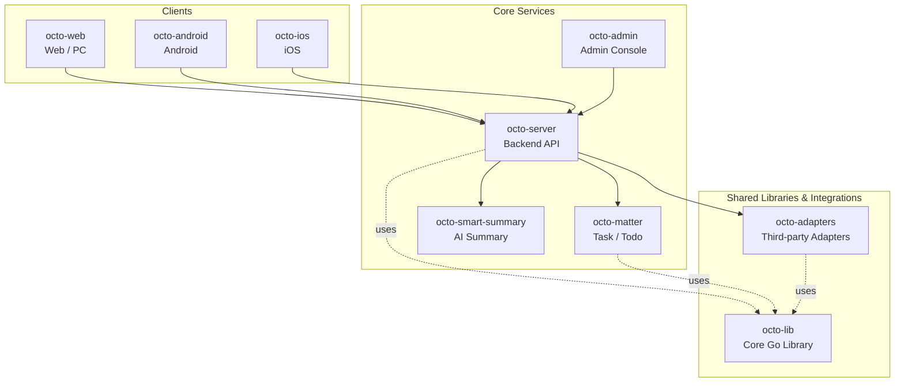

<p align="center">
  <sub>🛰</sub>
</p>

<p align="center">
  <b>Octo Daemon — the local runtime monitor for OCTO.</b><br/>
  <sub>Probe every AI agent CLI on your box, report it to OCTO, get one-click remote upgrades — without leaving the workplace.</sub>
</p>

<p align="center">
  <a href="https://github.com/Mininglamp-OSS"><b>🏠 OCTO Home</b></a> ·
  <a href="#-quickstart"><b>🚀 Quickstart</b></a> ·
  <a href="#-octo-ecosystem"><b>📦 Ecosystem</b></a> ·
  <a href="https://github.com/Mininglamp-OSS/octo-server/blob/main/CONTRIBUTING.md"><b>🤝 Contributing</b></a>
</p>

<p align="center">
  <a href="./LICENSE"></a>
  <a href="./README.zh.md"></a>
  
  
</p>

---

> 🌐 **Read in**: **English** · [简体中文](README.zh.md)

# 🛰 Octo Daemon CLI

> **The local agent runtime reporter** for the OCTO platform. Detects installed AI agent CLIs (Claude Code, OpenClaw), reports status, agent bindings and plugin versions, supports remote one-click upgrades.

`octo-daemon` is the small Go binary that lives on every developer
machine and server in your fleet. It probes the AI agents installed
locally and pushes a live inventory to
[`octo-server`](https://github.com/Mininglamp-OSS/octo-server)
so [`octo-web`](https://github.com/Mininglamp-OSS/octo-web) can render
the Runtimes view and trigger remote
upgrades.

## 🌟 Why Octo Daemon

- **Fast inventory.** Point the binary at a space with `octo-daemon config`, run `octo-daemon start`, and every Claude / OpenClaw install on that machine appears on the OCTO Runtimes page within seconds. One daemon can serve **multiple spaces** at once.
- **Remote upgrades, no SSH.** OpenClaw / cc-octo plugins and provider CLIs (Claude, OpenClaw) can be upgraded from the OCTO web UI — atomic claim on the server, version-pinned downloads, register-time close-out. The daemon binary itself rolls via npm / k8s, not in-process.
- **Self-healing by design.** Two-stage detection (fast register + async deep probe), 60s rescan, 30s server-side sweeper. Each space runs in its own supervised loop: a failing space is isolated and retried without affecting the others, and an evicted API key shuts that space down cleanly.

## 🚀 Quickstart

### 1. Install

```bash
npm install -g @mininglamp-oss/octo-daemon
```

The daemon's own prebuilt binary ships inside a platform sub-package selected
automatically by npm (darwin / linux on x64 / arm64) — the daemon binary
itself has no postinstall download. Other platforms (including Windows):
build from source (see below).

> **Bundled `octo-cli` — networked install (intentional).** This package
> declares `@mininglamp-oss/octo-cli` as a dependency so the CLI lands on
> every machine running the daemon. Unlike the daemon binary, octo-cli pulls
> its binary via a **postinstall download**, so `npm install -g` reaches the
> network for that dependency and is **not** fully mirror-transparent, and it
> inherits octo-cli's `os`/`cpu` matrix (darwin/linux/win32 × x64/arm64). This
> is a deliberate product decision: octo-cli is a required companion, so a
> failed octo-cli install fails loudly rather than silently leaving it absent.
> Air-gapped / mirror-only deployments must provision octo-cli's binary
> out-of-band.

`npm install -g` puts the `octo-daemon` command on your PATH automatically
(a symlink in npm's global bin dir) — **no manual PATH editing needed**.
Confirm it resolves:

```bash
octo-daemon version
```

> **`octo-daemon: command not found`?** npm's global bin dir is not on your
> PATH (common with nvm or a custom prefix). Print the dir with
> `echo "$(npm config get prefix)/bin"` and add it to your `PATH`.

### 2. Get your connection values

In OCTO, send `/daemon` to BotFather. It returns the values you need for the
next step: the **server URL** and your **API key**. (The space is resolved
automatically — see below.)

### 3. Configure a space

```bash
octo-daemon config \
  --server-url "http://your-server:3000" \
  --api-key    "uk_xxx"
```

`config` verifies your `--api-key` against fleet
(`POST <fleet-url>/v1/runtimes/verify`) and **only persists a profile when
verification succeeds**. The `space_id` is returned by that call — you no longer
pass `--space-id`. On failure (bad key, wrong URL, network error) nothing is
written and the error is printed.

`--fleet-url` is **optional**: when omitted it defaults to
`<server-url>/fleet/api` (so `http://your-server:8090` →
`http://your-server:8090/fleet/api`). Pass `--fleet-url` only for split-service
deployments where fleet lives elsewhere (e.g. `--fleet-url http://localhost:8092`
→ verify hits `http://localhost:8092/v1/runtimes/verify`).

On success `config` creates `~/.octo-daemon/<space_id>/` (generating that
space's `daemon.id`) and upserts the profile into `~/.octo-daemon/config.json`.
It is **idempotent by the resolved `space_id`**: re-running updates that profile
in place. To connect one machine to **multiple spaces**, run `config` once per
api-key — each gets its own profile and its own backend connection.

> `--matter-url` is accepted and stored for future use but is optional.

### 4. Start

```bash
octo-daemon start            # foreground (blocks the terminal)
octo-daemon start --daemon   # background (detached); logs to ~/.octo-daemon/daemon.log
octo-daemon stop             # stop a running daemon (foreground or --daemon)
```

`start` reads **every** configured profile from `config.json` and supervises one
backend connection per space inside a single process. A single space's failure
(bad URL, evicted key) is isolated and retried without affecting the others.

### 5. Check status

```bash
octo-daemon status            # process / version / per-space profiles
```

> Running as a managed `launchd` / `systemd` service is on the roadmap but not
> documented yet — for now use `octo-daemon start --daemon` for a background
> process.

## ⚙️ Configuration & environment

Each space's connection is stored as a **profile** in
`~/.octo-daemon/config.json` (written by `octo-daemon config`):

| Field | Required | Purpose |
|---|---|---|
| `space_id` | resolved | Profile key + per-space data directory name; returned by `verify`, not supplied |
| `api_key` | yes | Space-scoped API key |
| `server_url` | yes | Auth + bot-token endpoints |
| `fleet_url` | no | Runtime / bot endpoints + SSE; defaults to `<server_url>/fleet/api` |
| `matter_url` | no | Reserved for future use (stored, not yet consumed) |

> **Split-service deployments** pass an explicit `--fleet-url` so fleet and
> `server_url` point at different hosts; a single-host deployment omits it and
> lets `fleet_url` derive from `server_url`. The old `OCTO_FLEET_URL` /
> `OCTO_SERVER_URL` environment variables have been **removed** — routing now
> lives per-profile in `config.json`. There is no separate matter URL env var
> either.

The remaining environment variables are runtime knobs, not routing:

| Variable | Default | When to set |
|---|---|---|
| `OCTO_SSE_DISABLED` | unset | Set to `1` to disable the SSE reverse-dispatch channel and fall back to heartbeat polling (rollback knob). |
| `OCTO_SLOW_DETECT_SECONDS` | `60` | Rescan interval for deep agent detection — tuning only. |

## 📦 Supported agents

| Agent | Probe | Status rule | Extra data |
|-------|-------|-------------|------------|
| Claude Code | `claude --version` + cc-channel-octo gateway probe | Gateway running = online | cc-octo plugin version |
| OpenClaw | `openclaw --version` + gateway port probe | Gateway listening = online | Agent list, bindings, plugins |

## 🧬 How it works

1. **Fast register (< 5s)** — Parallel `exec.LookPath` + `--version`
   probes; everything that's installed reports `online` immediately.
2. **Slow detect (async)** — OpenClaw `agents list`, `agents
   bindings`, `plugins list` run in background goroutines and
   re-register when bindings or plugin versions change.
3. **Heartbeat (5s)** — Keeps the runtime alive; the server claims
   pending upgrade tasks on the response.
4. **Rescan (60s)** — Detects newly-installed CLIs, version bumps,
   gateway up/down transitions; re-registers on change.
5. **Server sweeper (30s)** — Marks runtimes offline after 45s of
   silence, deletes after 7 days; expires stuck upgrade tasks.

## 🗂 Local data

Everything lives under `~/.octo-daemon/`:

| Path | Purpose |
|------|---------|
| `config.json` | Profiles (one per space); written by `octo-daemon config`, read by `start` |
| `<space_id>/daemon.id` | Per-space daemon identity (UUID v7, generated once, kept forever) |
| `<space_id>/events.state` | Per-space SSE dedup cursor |
| `daemon.lock` | File lock — single-instance guard (one process serves all spaces) |
| `daemon.pid` | Current process PID |
| `daemon.log` | Background (`start --daemon`) stdout/stderr |

## 🛠 Build from source

```bash
git clone https://github.com/Mininglamp-OSS/octo-daemon-cli.git
cd octo-daemon-cli
make build
```

Cross-compile:

```bash
GOOS=linux  GOARCH=amd64 make build
GOOS=darwin GOARCH=arm64 make build
```

## 🚢 Releasing (maintainers)

Releases are fully automated from a single tag push. Tag a commit that is
**already merged and green on `main`**, then push the tag:

```bash
git tag v1.2.3 <commit-on-main>
git push origin v1.2.3
```

That is the only manual step. It triggers, in order:

1. **`release-on-tag.yml`** — checks the tag is semver, resolves the
   successful `CI` run for the tagged commit (fail-fast if the commit has no
   green CI run on `main`), and dispatches the gated release flow.
2. **`release-publish.yml`** — re-validates the CI evidence (org-standard
   gate), creates the GitHub Release, and builds the platform binaries with
   GoReleaser.
3. **`npm-publish.yml`** — downloads the release archives, verifies
   `checksums.txt`, repacks them into the npm packages, and publishes
   `@mininglamp-oss/octo-daemon` + the four `*-<os>-<cpu>` platform
   sub-packages.

Version → npm dist-tag: `v1.2.3` → `@latest`; a prerelease (`v1.2.3-rc.1`) →
`@next`; a backport older than the current `@latest` is published under a
non-`latest` tag rather than moving `@latest` backwards.

**Prerequisites**

- The tagged commit must have a passing `CI` run on `main` — the evidence gate
  refuses to publish without it.
- The `NPM_TOKEN` repo/org secret must be authorized to publish (and create)
  the `@mininglamp-oss/octo-daemon*` packages.

**Manual / recovery**

`release-publish.yml` and `npm-publish.yml` stay dispatchable from the Actions
tab (`workflow_dispatch`) for re-runs after a transient failure.
`npm-publish.yml` defaults to `dry_run=true` for safe plumbing checks and
skips packages already on the registry, so re-runs are idempotent.

## 🔗 OCTO Ecosystem

<!-- shared snippet: OCTO repo matrix. Keep identical across all 9 repos. -->



| Repository | Language | Role |
|---|---|---|
| [`octo-server`](https://github.com/Mininglamp-OSS/octo-server) | Go | Backend API · business orchestration · Lobster agent scheduling |
| [`octo-matter`](https://github.com/Mininglamp-OSS/octo-matter) | Go | Task / Todo / Matter micro-service |
| [`octo-smart-summary`](https://github.com/Mininglamp-OSS/octo-smart-summary) | Go | LLM-powered conversation summarisation |
| [`octo-web`](https://github.com/Mininglamp-OSS/octo-web) | TypeScript / React | Web & PC (Electron) client |
| [`octo-android`](https://github.com/Mininglamp-OSS/octo-android) | Kotlin / Java | Native Android client |
| [`octo-ios`](https://github.com/Mininglamp-OSS/octo-ios) | Swift / Objective-C | Native iOS client |
| [`octo-admin`](https://github.com/Mininglamp-OSS/octo-admin) | TypeScript / React | Admin console (tenant / org / user / channel management) |
| [`octo-lib`](https://github.com/Mininglamp-OSS/octo-lib) | Go | Shared core library (protocol, crypto, storage, HTTP) |
| [`octo-adapters`](https://github.com/Mininglamp-OSS/octo-adapters) | TypeScript / Python | Third-party integrations (IM bridges, AI channels) |

## 🤝 Contributing

`octo-daemon-cli` follows the OCTO platform-wide contribution
workflow. Please read the shared guidelines in the
[`octo-server`](https://github.com/Mininglamp-OSS/octo-server)
repository:

- [CONTRIBUTING.md](https://github.com/Mininglamp-OSS/octo-server/blob/main/CONTRIBUTING.md)
- [CODE_OF_CONDUCT.md](https://github.com/Mininglamp-OSS/octo-server/blob/main/CODE_OF_CONDUCT.md)
- [SECURITY.md](https://github.com/Mininglamp-OSS/octo-server/blob/main/SECURITY.md) — please follow this for security disclosures instead of the public tracker.

## 📄 License

Apache License 2.0 — see [LICENSE](LICENSE) for the full text and
[NOTICE](NOTICE) for third-party attributions.

---

<p align="center">
  <sub>Made with 🐙 by <b>OCTO Contributors</b> · <a href="https://github.com/Mininglamp-OSS">Mininglamp-OSS</a></sub>
</p>
