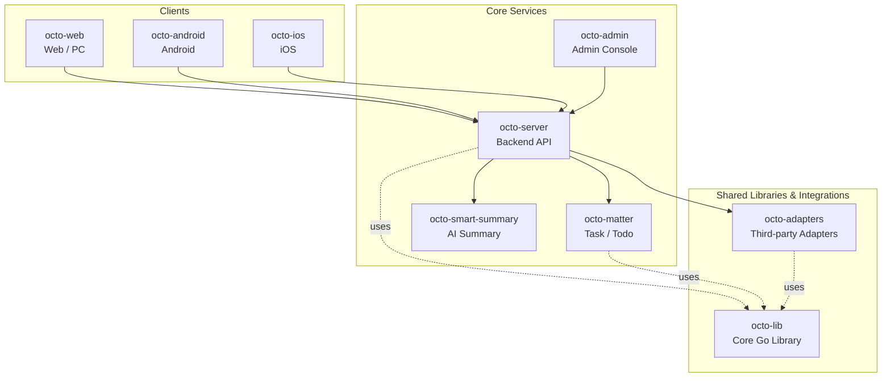

<p align="center">
  <sub>🛰</sub>
</p>

<p align="center">
  <b>Octo Daemon — the local runtime monitor for OCTO.</b><br/>
  <sub>Probe every AI agent CLI on your box, report it to OCTO, get one-click remote upgrades — without leaving the workplace.</sub>
</p>

<p align="center">
  <a href="https://github.com/Mininglamp-OSS"><b>🏠 OCTO Home</b></a> ·
  <a href="#-quickstart"><b>🚀 Quickstart</b></a> ·
  <a href="#-octo-ecosystem"><b>📦 Ecosystem</b></a> ·
  <a href="https://github.com/Mininglamp-OSS/octo-server/blob/main/CONTRIBUTING.md"><b>🤝 Contributing</b></a>
</p>

<p align="center">
  <a href="./LICENSE"></a>
  <a href="./README.zh.md"></a>
  
  
</p>

---

> 🌐 **Read in**: **English** · [简体中文](README.zh.md)

# 🛰 Octo Daemon CLI

> **The local agent runtime reporter** for the OCTO platform. Detects installed AI agent CLIs (Claude Code, OpenClaw), reports status, agent bindings and plugin versions, supports remote one-click upgrades.

`octo-daemon` is the small Go binary that lives on every developer
machine and server in your fleet. It runs as a `launchd` / `systemd`
service, probes the AI agents installed locally, and pushes a live
inventory to [`octo-server`](https://github.com/Mininglamp-OSS/octo-server)
so [`octo-web`](https://github.com/Mininglamp-OSS/octo-web) can render
the Runtimes view and trigger remote
upgrades.

## 🌟 Why Octo Daemon

- **Zero-config inventory.** Drop the binary on a box, run `octo-daemon service install`, and every Claude / OpenClaw install on that machine appears on the OCTO Runtimes page within seconds.
- **Remote upgrades, no SSH.** Daemon, OpenClaw plugins, and provider CLIs (Claude, OpenClaw itself) can all be upgraded from the OCTO web UI — atomic claim on the server, version-pinned downloads, register-time close-out.
- **Self-healing by design.** Two-stage detection (fast register + async deep probe), 60s rescan, 30s server-side sweeper, exit-code-driven service respawn. A crashed daemon is back online in 10 seconds; an evicted API key shuts itself down cleanly.

## 🚀 Quickstart

### 1. Install

```bash
npm install -g @mininglamp-oss/octo-daemon
```

The matching prebuilt binary ships inside a platform sub-package selected
automatically by npm (darwin / linux on x64 / arm64) — there is no
postinstall download, so registry mirrors work transparently. Other
platforms (including Windows): build from source (see below).

`npm install -g` puts the `octo-daemon` command on your PATH automatically
(a symlink in npm's global bin dir) — **no manual PATH editing needed**.
Confirm it resolves:

```bash
octo-daemon version
```

> **`octo-daemon: command not found`?** npm's global bin dir is not on your
> PATH (common with nvm or a custom prefix). Print the dir with
> `echo "$(npm config get prefix)/bin"` and add it to your `PATH`.

### 2. Get an API key

In OCTO, send `/daemon` to BotFather. It returns the complete install
command including your API key and server URL.

### 3. Start

```bash
octo-daemon start --api-key "uk_xxx" --api-url "http://your-server:8090"
```

`start` runs in the **foreground** (blocks the terminal) — good for a first
run to watch it register. For a persistent background daemon, use the service
in step 4 instead.

### 4. (Recommended) Install as a service

```bash
octo-daemon service install
```

On macOS this registers a user-level `launchd` agent
(`ai.octo.daemon`); on Linux it registers a `systemd --user` unit.
The service auto-starts at login, restarts on crash within 10
seconds, and respawns with the new binary after a remote upgrade.

### 5. Check status

```bash
octo-daemon status            # process / version
octo-daemon service status    # service install state + last log line
```

## ⚙️ Environment variables

A single-host deployment needs only `--api-key` and `--api-url`. The variables
below are optional; the daemon reads them from the environment (set them before
`start`, or in the service env file). BotFather's `/daemon` reply already
includes whichever URLs your deployment needs — these are documented here for
custom/split setups.

| Variable | Default | When to set |
|---|---|---|
| `OCTO_FLEET_URL` | `--api-url` | **Split-service deployment** — fleet (runtime/bot endpoints) runs at a different URL than the main API. |
| `OCTO_SERVER_URL` | `--api-url` | **Split-service deployment** — auth / bot-token endpoints run at a different URL than the main API. |
| `OCTO_SSE_DISABLED` | unset | Set to `1` to disable the SSE reverse-dispatch channel and fall back to heartbeat polling (rollback knob). |
| `OCTO_SLOW_DETECT_SECONDS` | `60` | Rescan interval for deep agent detection — tuning only. |

> The daemon reaches matter (task ack/pull) through the fleet/server endpoints
> above — there is **no** separate matter URL variable. (An `OCTO_MATTER_URL`
> seen in older BotFather output is unused by the daemon.)

## 📦 Supported agents

| Agent | Probe | Status rule | Extra data |
|-------|-------|-------------|------------|
| Claude Code | `claude --version` + cc-channel-octo gateway probe | Gateway running = online | — |
| OpenClaw | `openclaw --version` + gateway port probe | Gateway listening = online | Agent list, bindings, plugins |

## 🧬 How it works

1. **Fast register (< 5s)** — Parallel `exec.LookPath` + `--version`
   probes; everything that's installed reports `online` immediately.
2. **Slow detect (async)** — OpenClaw `agents list`, `agents
   bindings`, `plugins list` run in background goroutines and
   re-register when bindings or plugin versions change.
3. **Heartbeat (15s)** — Keeps the runtime alive; the server claims
   pending upgrade tasks on the response.
4. **Rescan (60s)** — Detects newly-installed CLIs, version bumps,
   gateway up/down transitions; re-registers on change.
5. **Server sweeper (30s)** — Marks runtimes offline after 45s of
   silence, deletes after 7 days; expires stuck upgrade tasks.
6. **Service-mode self-heal** — `launchd KeepAlive` /
   `systemd Restart=on-failure` plus exit-code mapping (75 =
   respawn-after-upgrade; 78 = api-key-evicted-don't-loop; 0 = clean
   exit).

## 🗂 Local data

Everything lives under `~/.octo-daemon/`:

| File | Purpose |
|------|---------|
| `daemon.id` | Machine UUID (v7, generated once, kept forever) |
| `daemon.lock` | File lock — single-instance guard |
| `daemon.pid` | Current process PID |
| `config.json` | `service install` reads this for api-key / api-url |
| `service-env/ai.octo.daemon.env` | Service-mode env file (HOME / PATH / OCTO_DAEMON_UNDER_SERVICE=1) |
| `service-env/ai.octo.daemon-env-wrapper.sh` | Service-mode `exec` wrapper |
| `logs/daemon.log` | macOS service stdout (Linux uses journal) |

## 🛠 Build from source

```bash
git clone https://github.com/Mininglamp-OSS/octo-daemon-cli.git
cd octo-daemon-cli
make build
```

Cross-compile:

```bash
GOOS=linux  GOARCH=amd64 make build
GOOS=darwin GOARCH=arm64 make build
```

## 🚢 Releasing (maintainers)

Releases are fully automated from a single tag push. Tag a commit that is
**already merged and green on `main`**, then push the tag:

```bash
git tag v1.2.3 <commit-on-main>
git push origin v1.2.3
```

That is the only manual step. It triggers, in order:

1. **`release-on-tag.yml`** — checks the tag is semver, resolves the
   successful `CI` run for the tagged commit (fail-fast if the commit has no
   green CI run on `main`), and dispatches the gated release flow.
2. **`release-publish.yml`** — re-validates the CI evidence (org-standard
   gate), creates the GitHub Release, and builds the platform binaries with
   GoReleaser.
3. **`npm-publish.yml`** — downloads the release archives, verifies
   `checksums.txt`, repacks them into the npm packages, and publishes
   `@mininglamp-oss/octo-daemon` + the four `*-<os>-<cpu>` platform
   sub-packages.

Version → npm dist-tag: `v1.2.3` → `@latest`; a prerelease (`v1.2.3-rc.1`) →
`@next`; a backport older than the current `@latest` is published under a
non-`latest` tag rather than moving `@latest` backwards.

**Prerequisites**

- The tagged commit must have a passing `CI` run on `main` — the evidence gate
  refuses to publish without it.
- The `NPM_TOKEN` repo/org secret must be authorized to publish (and create)
  the `@mininglamp-oss/octo-daemon*` packages.

**Manual / recovery**

`release-publish.yml` and `npm-publish.yml` stay dispatchable from the Actions
tab (`workflow_dispatch`) for re-runs after a transient failure.
`npm-publish.yml` defaults to `dry_run=true` for safe plumbing checks and
skips packages already on the registry, so re-runs are idempotent.

## 🔗 OCTO Ecosystem

<!-- shared snippet: OCTO repo matrix. Keep identical across all 9 repos. -->



| Repository | Language | Role |
|---|---|---|
| [`octo-server`](https://github.com/Mininglamp-OSS/octo-server) | Go | Backend API · business orchestration · Lobster agent scheduling |
| [`octo-matter`](https://github.com/Mininglamp-OSS/octo-matter) | Go | Task / Todo / Matter micro-service |
| [`octo-smart-summary`](https://github.com/Mininglamp-OSS/octo-smart-summary) | Go | LLM-powered conversation summarisation |
| [`octo-web`](https://github.com/Mininglamp-OSS/octo-web) | TypeScript / React | Web & PC (Electron) client |
| [`octo-android`](https://github.com/Mininglamp-OSS/octo-android) | Kotlin / Java | Native Android client |
| [`octo-ios`](https://github.com/Mininglamp-OSS/octo-ios) | Swift / Objective-C | Native iOS client |
| [`octo-admin`](https://github.com/Mininglamp-OSS/octo-admin) | TypeScript / React | Admin console (tenant / org / user / channel management) |
| [`octo-lib`](https://github.com/Mininglamp-OSS/octo-lib) | Go | Shared core library (protocol, crypto, storage, HTTP) |
| [`octo-adapters`](https://github.com/Mininglamp-OSS/octo-adapters) | TypeScript / Python | Third-party integrations (IM bridges, AI channels) |

## 🤝 Contributing

`octo-daemon-cli` follows the OCTO platform-wide contribution
workflow. Please read the shared guidelines in the
[`octo-server`](https://github.com/Mininglamp-OSS/octo-server)
repository:

- [CONTRIBUTING.md](https://github.com/Mininglamp-OSS/octo-server/blob/main/CONTRIBUTING.md)
- [CODE_OF_CONDUCT.md](https://github.com/Mininglamp-OSS/octo-server/blob/main/CODE_OF_CONDUCT.md)
- [SECURITY.md](https://github.com/Mininglamp-OSS/octo-server/blob/main/SECURITY.md) — please follow this for security disclosures instead of the public tracker.

## 📄 License

Apache License 2.0 — see [LICENSE](LICENSE) for the full text and
[NOTICE](NOTICE) for third-party attributions.

---

<p align="center">
  <sub>Made with 🐙 by <b>OCTO Contributors</b> · <a href="https://github.com/Mininglamp-OSS">Mininglamp-OSS</a></sub>
</p>
