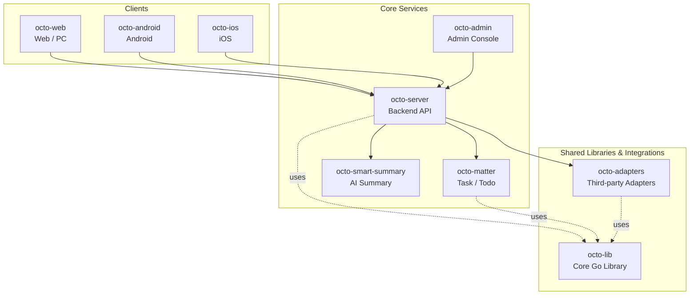

<p align="center">
  <sub>🛰</sub>
</p>

<p align="center">
  <b>Octo Daemon —— OCTO 平台的本机 Agent Runtime 监控守护进程。</b><br/>
  <sub>探测本机所有 AI Agent CLI、上报到 OCTO、一键远程升级 —— 全程不离开工作区。</sub>
</p>

<p align="center">
  <a href="https://github.com/Mininglamp-OSS"><b>🏠 OCTO 主页</b></a> ·
  <a href="#-快速开始"><b>🚀 快速开始</b></a> ·
  <a href="#-octo-生态"><b>📦 生态</b></a> ·
  <a href="https://github.com/Mininglamp-OSS/octo-server/blob/main/CONTRIBUTING.zh.md"><b>🤝 贡献</b></a>
</p>

<p align="center">
  <a href="./LICENSE"></a>
  <a href="./README.md"></a>
  
  
</p>

---

> 🌐 **语言**: [English](README.md) · **简体中文**

# 🛰 Octo Daemon CLI（简体中文）

> **OCTO 平台的本机 Agent Runtime 上报守护进程**。自动检测本机已安装的 AI Agent CLI（Claude Code、OpenClaw），上报版本、agent 绑定和插件状态，支持远程一键升级。

`octo-daemon` 是一个轻量级 Go 二进制，安装在团队成员的开发机或
服务器上，自动探测本机 AI Agent，并把实时清单上报给
[`octo-server`](https://github.com/Mininglamp-OSS/octo-server)，由
[`octo-web`](https://github.com/Mininglamp-OSS/octo-web) 在 Runtimes
页面渲染和触发远程升级。

## 🌟 为什么用 Octo Daemon

- **快速清单。** 用 `octo-daemon config` 把二进制对准一个 space，执行 `octo-daemon start`，本机上所有 Claude / OpenClaw 都会在数秒内出现在 OCTO Runtimes 页面。一个 daemon 可同时服务**多个 space**。
- **远程升级，无需 SSH。** OpenClaw / cc-octo 插件以及 provider CLI（Claude / OpenClaw）都可以从 OCTO Web 一键升级 —— 服务端 atomic claim、版本 pin、register 时自动关单。daemon 二进制本身走 npm / k8s 编排升级，不在进程内自升级。
- **天然自愈。** 两阶段探测（快注册 + 异步深探）、60s 周期重扫、服务端 30s sweeper。每个 space 各跑一条受监管的循环：出问题的 space 会被隔离重试、不影响其他 space；API key 被踢则该 space 干净退出。

## 🚀 快速开始

### 1. 安装

```bash
npm install -g @mininglamp-oss/octo-daemon
```

预编译二进制打包在平台子包里，由 npm 按当前系统自动选择（darwin /
linux，x64 / arm64）——没有 postinstall 下载，npm 镜像源
（如 npmmirror）开箱即用。其他平台（含 Windows）请从源码构建（见下文）。

`npm install -g` 会把 `octo-daemon` 命令自动放进 npm 全局 bin 目录的
PATH 软链里——**无需手动改 PATH**。验证：

```bash
octo-daemon version
```

> **报 `octo-daemon: command not found`？** 说明 npm 全局 bin 目录不在
> PATH 上（nvm 或自定义 prefix 常见）。用 `echo "$(npm config get prefix)/bin"`
> 打印该目录，加进 `PATH` 即可。

### 2. 拿到连接参数

在 OCTO 里向 BotFather 发 `/daemon`，会返回下一步需要的参数：**server 地址**
和你的 **API key**。（space 会自动解析得到——见下文。）

### 3. 配置一个 space

```bash
octo-daemon config \
  --server-url "http://your-server:3000" \
  --api-key    "uk_xxx"
```

`config` 会先用 `--api-key` 向 fleet 发起校验
（`POST <fleet-url>/v1/runtimes/verify`），**只有校验通过才会写入 profile**。
`space_id` 由该接口返回——你不再需要传 `--space-id`。校验失败时（key 错、地址
错、网络异常）不写任何配置，并打印错误信息。

`--fleet-url` 现在**可选**：不传时默认取 `<server-url>/fleet/api`（即
`http://your-server:8090` → `http://your-server:8090/fleet/api`）。仅当 fleet
部署在别处的拆分场景才需要显式传 `--fleet-url`（例如 `--fleet-url
http://localhost:8092` → 校验打到 `http://localhost:8092/v1/runtimes/verify`）。

校验通过后，`config` 会创建 `~/.octo-daemon/<space_id>/`（生成该 space 的
`daemon.id`），并把这条 profile upsert 进 `~/.octo-daemon/config.json`。它
**按解析出的 `space_id` 幂等**：重复执行只更新该 profile。要让一台机器连
**多个 space**，对每个 api-key 各跑一次 `config`——各自独立的 profile、独立的
后端连接。

> `--matter-url` 可传，会被存下供将来使用，目前可选。

### 4. 启动

```bash
octo-daemon start            # 前台运行（占住终端）
octo-daemon start --daemon   # 引导 pm2 托管 daemon，完成后自身退出
octo-daemon stop             # 停止前台运行的 daemon
```

`start` 读取 `config.json` 里**所有** profile，在单进程内为每个 space 各维持
一条后端连接。单个 space 出问题（URL 错、key 被踢）会被隔离重试，不影响其他
space。

`start --daemon` **不会**自己跑 daemon——它把 daemon 注册成 pm2 托管的服务：
缺 pm2 就装、写 `~/.octo-daemon/ecosystem.config.js`（让 pm2 以前台模式拉起
Go 二进制）、执行 `pm2 startOrRestart` + `pm2 save`，然后自身退出。pm2 负责保活，
升级后会重新 exec 新二进制。可选地跑 `pm2 startup`（会打印一条 sudo 命令）让
pm2——以及 daemon——开机自启。

注册之后,直接用 pm2 管理它:

```bash
pm2 stop octo-daemon          # 停止 pm2 托管的 daemon
pm2 restart octo-daemon       # 重启（升级后也用它重新 exec 新二进制）
pm2 delete octo-daemon        # 从 pm2 中彻底移除
pm2 logs octo-daemon          # 查看日志
```

> `octo-daemon stop` 给持锁的 daemon pid 发信号（前台运行或受 supervisor 托管都适用）。
> 在 supervisor（pm2 / systemd / ...）下它会被重新拉起——`upgrade` 正是借此应用新二进制。
> 想彻底停掉 pm2 托管的 daemon，请用 `pm2 stop octo-daemon`。

### 5. 查看状态

```bash
octo-daemon status            # 进程 / 版本 / 各 space profile
pm2 list                      # pm2 托管的 daemon 状态（经 --daemon 注册后）
```

### 6. 升级

```bash
octo-daemon upgrade           # npm install -g @latest，然后 `octo-daemon stop`（由 supervisor 拉起）
```

> `upgrade` 只装新二进制并停掉 daemon——拉起交给 supervisor，所以 supervisor 必须配置为
> 退出即重启（pm2 默认即可；systemd 用 `Restart=always`；supervisord 用 `autorestart=true`）。
> systemd `Restart=on-failure` 不会拉起干净退出的进程。

## ⚙️ 配置与环境变量

每个 space 的连接以一条 **profile** 存在 `~/.octo-daemon/config.json`
（由 `octo-daemon config` 写入）：

| 字段 | 必填 | 用途 |
|---|---|---|
| `space_id` | 解析得到 | profile 主键 + 该 space 的数据目录名；由 `verify` 返回，不需手动传 |
| `api_key` | 是 | space 级 API key |
| `server_url` | 是 | auth + bot-token 端点 |
| `fleet_url` | 否 | runtime / bot 端点 + SSE；默认取 `<server_url>/fleet/api` |
| `matter_url` | 否 | 预留，将来使用（存下但暂未消费） |

> **服务拆分部署**显式传 `--fleet-url`，让 fleet 与 `server_url` 指向不同主机；
> 单机部署省略即可，`fleet_url` 会从 `server_url` 推导。旧的 `OCTO_FLEET_URL` /
> `OCTO_SERVER_URL` 环境变量已**移除**——路由现在按 profile 存在 `config.json`
> 里。也没有单独的 matter URL 环境变量。

剩下的环境变量是运行期开关，不是路由：

| 变量 | 默认 | 何时设置 |
|---|---|---|
| `OCTO_SSE_DISABLED` | 未设 | 设为 `1` 关闭 SSE 反向派发，回退到 heartbeat 轮询（回滚开关）。 |
| `OCTO_SLOW_DETECT_SECONDS` | `60` | 深度 agent 探测的重扫间隔——仅调优用。 |

## 📦 支持的 Agent

| Agent | 检测方式 | 状态判定 | 附加信息 |
|-------|---------|---------|---------|
| Claude Code | `claude --version` + cc-channel-octo gateway 探测 | Gateway 运行 = 在线 | cc-octo 插件版本 |
| OpenClaw | `openclaw --version` + gateway 端口探测 | Gateway 在监听 = 在线 | Agent 列表、bindings、插件 |

## 🧬 工作原理

1. **快速注册（< 5s）** —— 并行 `exec.LookPath` + `--version` 探测，所有已安装的立即上报 `online`。
2. **慢速深探（异步）** —— OpenClaw `agents list / bindings / plugins list` 在后台 goroutine 跑，bindings / 插件版本变化时 re-register。
3. **心跳（5s）** —— 维持 runtime 在线，服务端在响应里下发 pending upgrade 任务。
4. **重扫（60s）** —— 检测新装 CLI、版本变化、gateway 启停，变化触发 re-register。
5. **服务端 sweeper（30s）** —— 45s 无心跳标 offline，7 天后删除；卡住的 upgrade 任务自动 timeout。

## 🗂 本地数据

数据全部在 `~/.octo-daemon/` 下：

| 路径 | 用途 |
|------|------|
| `config.json` | profile 列表（每 space 一条）；`octo-daemon config` 写、`start` 读 |
| `<space_id>/daemon.id` | 该 space 的 daemon 身份（v7 UUID，首次生成永久保留） |
| `<space_id>/events.state` | 该 space 的 SSE 去重游标 |
| `daemon.lock` | 文件锁，单实例保护（一个进程服务所有 space） |
| `daemon.pid` | 当前进程 PID |
| `ecosystem.config.js` | pm2 服务定义（`start --daemon` 写入）；日志由 pm2 管理 |

## 🛠 从源码构建

```bash
git clone https://github.com/Mininglamp-OSS/octo-daemon-cli.git
cd octo-daemon-cli
make build
```

交叉编译：

```bash
GOOS=linux  GOARCH=amd64 make build
GOOS=darwin GOARCH=arm64 make build
```

## 🚢 发版（维护者）

发版完全自动化，只需推一个 tag。给一个**已经合进 `main` 且 CI 已绿**的
commit 打 tag，推上去：

```bash
git tag v1.2.3 <main-上的-commit>
git push origin v1.2.3
```

这是唯一的手动步骤。之后依次自动触发：

1. **`release-on-tag.yml`** —— 校验 tag 是 semver，解析该 commit 上成功的
   `CI` run（commit 在 `main` 上没有绿色 CI run 则 fail-fast），再触发门控
   发布流程。
2. **`release-publish.yml`** —— 复验 CI 证据（组织标准门禁），创建 GitHub
   Release，用 GoReleaser 编译各平台二进制。
3. **`npm-publish.yml`** —— 下载 Release 产物、校验 `checksums.txt`、重新
   打包为 npm 包，发布 `@mininglamp-oss/octo-daemon` + 4 个
   `*-<os>-<cpu>` 平台子包。

版本 → npm dist-tag：`v1.2.3` → `@latest`；预发布（`v1.2.3-rc.1`）→
`@next`；比当前 `@latest` 更旧的 backport 会发到非 `latest` 的 tag，不会把
`@latest` 往回退。

**前置条件**

- 打 tag 的 commit 必须在 `main` 上有一次通过的 `CI` run——证据门禁没有它
  就拒绝发布。
- `NPM_TOKEN`（仓库 / org secret）须有发布（及创建）
  `@mininglamp-oss/octo-daemon*` 包的权限。

**手动 / 恢复**

`release-publish.yml` 和 `npm-publish.yml` 仍可从 Actions 页手动触发
（`workflow_dispatch`），用于瞬时失败后的重跑。`npm-publish.yml` 默认
`dry_run=true` 便于安全地空跑验证链路，且会跳过 registry 上已存在的包，
重跑幂等。

## 🔗 OCTO 生态

<!-- shared snippet: OCTO repo matrix. Keep identical across all 9 repos. -->



| 仓库 | 语言 | 角色 |
|---|---|---|
| [`octo-server`](https://github.com/Mininglamp-OSS/octo-server) | Go | 后端 API · 业务编排 · Lobster Agent 调度 |
| [`octo-matter`](https://github.com/Mininglamp-OSS/octo-matter) | Go | 任务 / 待办 / Matter 微服务 |
| [`octo-smart-summary`](https://github.com/Mininglamp-OSS/octo-smart-summary) | Go | LLM 驱动的会话摘要 |
| [`octo-web`](https://github.com/Mininglamp-OSS/octo-web) | TypeScript / React | Web 与 PC（Electron）客户端 |
| [`octo-android`](https://github.com/Mininglamp-OSS/octo-android) | Kotlin / Java | 原生 Android 客户端 |
| [`octo-ios`](https://github.com/Mininglamp-OSS/octo-ios) | Swift / Objective-C | 原生 iOS 客户端 |
| [`octo-admin`](https://github.com/Mininglamp-OSS/octo-admin) | TypeScript / React | 管理控制台（租户 / 组织 / 用户 / 频道） |
| [`octo-lib`](https://github.com/Mininglamp-OSS/octo-lib) | Go | 共享核心库（协议、加密、存储、HTTP） |
| [`octo-adapters`](https://github.com/Mininglamp-OSS/octo-adapters) | TypeScript / Python | 第三方集成（IM 桥接、AI channel） |

## 🤝 贡献

`octo-daemon-cli` 遵循 OCTO 平台级统一贡献流程，详见
[`octo-server`](https://github.com/Mininglamp-OSS/octo-server) 仓库
的共享文档：

- [CONTRIBUTING.zh.md](https://github.com/Mininglamp-OSS/octo-server/blob/main/CONTRIBUTING.zh.md)
- [CODE_OF_CONDUCT.zh.md](https://github.com/Mininglamp-OSS/octo-server/blob/main/CODE_OF_CONDUCT.zh.md)
- [SECURITY.zh.md](https://github.com/Mininglamp-OSS/octo-server/blob/main/SECURITY.zh.md) —— 安全问题请走这里，不要公开提 issue。

## 📄 许可证

Apache License 2.0 —— 完整文本见 [LICENSE](LICENSE)，第三方依赖归属
见 [NOTICE](NOTICE)。

---

<p align="center">
  <sub>Made with 🐙 by <b>OCTO Contributors</b> · <a href="https://github.com/Mininglamp-OSS">Mininglamp-OSS</a></sub>
</p>
