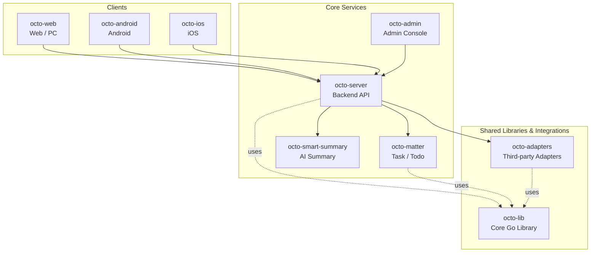

<p align="center">
  <sub>🛰</sub>
</p>

<p align="center">
  <b>Octo Daemon —— OCTO 平台的本机 Agent Runtime 监控守护进程。</b><br/>
  <sub>探测本机所有 AI Agent CLI、上报到 OCTO、一键远程升级 —— 全程不离开工作区。</sub>
</p>

<p align="center">
  <a href="https://github.com/Mininglamp-OSS"><b>🏠 OCTO 主页</b></a> ·
  <a href="#-快速开始"><b>🚀 快速开始</b></a> ·
  <a href="#-octo-生态"><b>📦 生态</b></a> ·
  <a href="https://github.com/Mininglamp-OSS/octo-server/blob/main/CONTRIBUTING.zh.md"><b>🤝 贡献</b></a>
</p>

<p align="center">
  <a href="./LICENSE"></a>
  <a href="./README.md"></a>
  
  
</p>

---

> 🌐 **语言**: [English](README.md) · **简体中文**

# 🛰 Octo Daemon CLI（简体中文）

> **OCTO 平台的本机 Agent Runtime 上报守护进程**。自动检测本机已安装的 AI Agent CLI（Claude Code、OpenClaw），上报版本、agent 绑定和插件状态，支持远程一键升级。

`octo-daemon` 是一个轻量级 Go 二进制，安装在团队成员的开发机或
服务器上，以 `launchd` / `systemd` 服务方式运行，自动探测本机 AI
Agent，并把实时清单上报给
[`octo-server`](https://github.com/Mininglamp-OSS/octo-server)，由
[`octo-web`](https://github.com/Mininglamp-OSS/octo-web) 在 Runtimes
页面渲染、做延迟测试和触发远程升级。

## 🌟 为什么用 Octo Daemon

- **零配置清单。** 把二进制放到机器上，执行 `octo-daemon service install`，本机上所有 Claude / OpenClaw 都会在数秒内出现在 OCTO Runtimes 页面。
- **远程升级，无需 SSH。** Daemon 本身、OpenClaw 插件以及 provider CLI（Claude / OpenClaw）都可以从 OCTO Web 一键升级 —— 服务端 atomic claim、版本 pin、register 时自动关单。
- **天然自愈。** 两阶段探测（快注册 + 异步深探）、60s 周期重扫、服务端 30s sweeper、exit-code 驱动 service 重启。崩溃 10 秒内回来；API key 被踢则干净退出不无限重启。

## 🚀 快速开始

### 1. 安装

```bash
npm install -g @mininglamp-oss/octo-daemon
```

预编译二进制打包在平台子包里，由 npm 按当前系统自动选择（darwin /
linux，x64 / arm64）——没有 postinstall 下载，npm 镜像源
（如 npmmirror）开箱即用。其他平台（含 Windows）请从源码构建（见下文）。

`npm install -g` 会把 `octo-daemon` 命令自动放进 npm 全局 bin 目录的
PATH 软链里——**无需手动改 PATH**。验证：

```bash
octo-daemon version
```

> **报 `octo-daemon: command not found`？** 说明 npm 全局 bin 目录不在
> PATH 上（nvm 或自定义 prefix 常见）。用 `echo "$(npm config get prefix)/bin"`
> 打印该目录，加进 `PATH` 即可。

### 2. 拿 API key

在 OCTO 里向 BotFather 发 `/daemon`，会返回完整启动命令（含 API
key 和服务器地址）。

### 3. 启动

```bash
octo-daemon start --api-key "uk_xxx" --api-url "http://your-server:8090"
```

`start` 默认**前台运行**（占住终端）——首次跑时方便观察注册过程。要常驻
后台，用第 4 步的系统服务。

> 单机部署 `--api-key` + `--api-url` 即可。**服务拆分部署**（fleet
> 独立）时还需设 `OCTO_FLEET_URL` / `OCTO_SERVER_URL`——见下方
> [环境变量](#-环境变量)。BotFather 的 `/daemon` 回复会给出适配你这套
> 部署的完整命令，照抄即可。

### 4.（推荐）装为系统服务

```bash
octo-daemon service install
```

macOS 上会注册一个用户级 `launchd` agent（`ai.octo.daemon`）；Linux
上注册 `systemd --user` unit。服务在用户登录时自启、崩溃 10 秒内
重启、远程升级后用新二进制重新拉起。

### 5. 查看状态

```bash
octo-daemon status            # 进程 / 版本
octo-daemon service status    # 服务安装状态 + 最后一条日志
```

## ⚙️ 环境变量

单机部署只需 `--api-key` 和 `--api-url`。下面这些是可选的，daemon 从环境
变量读取（在 `start` 前设好，或写进服务的 env 文件）。BotFather 的
`/daemon` 回复已经会带上你这套部署所需的 URL——这里列出供自定义 / 拆分
部署参考。

| 变量 | 默认 | 何时设置 |
|---|---|---|
| `OCTO_FLEET_URL` | `--api-url` | **服务拆分部署**——fleet（runtime/bot 端点）地址与主 API 不同。 |
| `OCTO_SERVER_URL` | `--api-url` | **服务拆分部署**——auth / bot-token 端点地址与主 API 不同。 |
| `OCTO_SSE_DISABLED` | 未设 | 设为 `1` 关闭 SSE 反向派发，回退到 heartbeat 轮询（回滚开关）。 |
| `OCTO_SLOW_DETECT_SECONDS` | `60` | 深度 agent 探测的重扫间隔——仅调优用。 |

> daemon 通过上面的 fleet/server 端点够到 matter（任务 ack/拉取），**没有**
> 单独的 matter URL 变量。（旧版 BotFather 输出里的 `OCTO_MATTER_URL`
> daemon 并不读取。）

## 📦 支持的 Agent

| Agent | 检测方式 | 状态判定 | 附加信息 |
|-------|---------|---------|---------|
| Claude Code | `claude --version` + cc-channel-octo gateway 探测 | Gateway 运行 = 在线 | — |
| OpenClaw | `openclaw --version` + gateway 端口探测 | Gateway 在监听 = 在线 | Agent 列表、bindings、插件 |

## 🧬 工作原理

1. **快速注册（< 5s）** —— 并行 `exec.LookPath` + `--version` 探测，所有已安装的立即上报 `online`。
2. **慢速深探（异步）** —— OpenClaw `agents list / bindings / plugins list` 在后台 goroutine 跑，bindings / 插件版本变化时 re-register。
3. **心跳（15s）** —— 维持 runtime 在线，服务端在响应里下发 pending upgrade 任务。
4. **重扫（60s）** —— 检测新装 CLI、版本变化、gateway 启停，变化触发 re-register。
5. **服务端 sweeper（30s）** —— 45s 无心跳标 offline，7 天后删除；卡住的 upgrade 任务自动 timeout。
6. **Service 模式自愈** —— `launchd KeepAlive` / `systemd Restart=on-failure` + exit-code 映射（75 = 升级后 respawn；78 = api-key 失效不循环；0 = 干净退出）。

## 🗂 本地数据

数据全部在 `~/.octo-daemon/` 下：

| 文件 | 用途 |
|------|------|
| `daemon.id` | 机器 UUID（v7，首次生成永久保留） |
| `daemon.lock` | 文件锁，单实例保护 |
| `daemon.pid` | 当前进程 PID |
| `config.json` | `service install` 读它取 api-key / api-url |
| `service-env/ai.octo.daemon.env` | Service 模式环境变量文件（HOME / PATH / OCTO_DAEMON_UNDER_SERVICE=1） |
| `service-env/ai.octo.daemon-env-wrapper.sh` | Service 模式 `exec` wrapper |
| `logs/daemon.log` | macOS service stdout（Linux 走 journal） |

## 🛠 从源码构建

```bash
git clone https://github.com/Mininglamp-OSS/octo-daemon-cli.git
cd octo-daemon-cli
make build
```

交叉编译：

```bash
GOOS=linux  GOARCH=amd64 make build
GOOS=darwin GOARCH=arm64 make build
```

## 🚢 发版（维护者）

发版完全自动化，只需推一个 tag。给一个**已经合进 `main` 且 CI 已绿**的
commit 打 tag，推上去：

```bash
git tag v1.2.3 <main-上的-commit>
git push origin v1.2.3
```

这是唯一的手动步骤。之后依次自动触发：

1. **`release-on-tag.yml`** —— 校验 tag 是 semver，解析该 commit 上成功的
   `CI` run（commit 在 `main` 上没有绿色 CI run 则 fail-fast），再触发门控
   发布流程。
2. **`release-publish.yml`** —— 复验 CI 证据（组织标准门禁），创建 GitHub
   Release，用 GoReleaser 编译各平台二进制。
3. **`npm-publish.yml`** —— 下载 Release 产物、校验 `checksums.txt`、重新
   打包为 npm 包，发布 `@mininglamp-oss/octo-daemon` + 4 个
   `*-<os>-<cpu>` 平台子包。

版本 → npm dist-tag：`v1.2.3` → `@latest`；预发布（`v1.2.3-rc.1`）→
`@next`；比当前 `@latest` 更旧的 backport 会发到非 `latest` 的 tag，不会把
`@latest` 往回退。

**前置条件**

- 打 tag 的 commit 必须在 `main` 上有一次通过的 `CI` run——证据门禁没有它
  就拒绝发布。
- `NPM_TOKEN`（仓库 / org secret）须有发布（及创建）
  `@mininglamp-oss/octo-daemon*` 包的权限。

**手动 / 恢复**

`release-publish.yml` 和 `npm-publish.yml` 仍可从 Actions 页手动触发
（`workflow_dispatch`），用于瞬时失败后的重跑。`npm-publish.yml` 默认
`dry_run=true` 便于安全地空跑验证链路，且会跳过 registry 上已存在的包，
重跑幂等。

## 🔗 OCTO 生态

<!-- shared snippet: OCTO repo matrix. Keep identical across all 9 repos. -->



| 仓库 | 语言 | 角色 |
|---|---|---|
| [`octo-server`](https://github.com/Mininglamp-OSS/octo-server) | Go | 后端 API · 业务编排 · Lobster Agent 调度 |
| [`octo-matter`](https://github.com/Mininglamp-OSS/octo-matter) | Go | 任务 / 待办 / Matter 微服务 |
| [`octo-smart-summary`](https://github.com/Mininglamp-OSS/octo-smart-summary) | Go | LLM 驱动的会话摘要 |
| [`octo-web`](https://github.com/Mininglamp-OSS/octo-web) | TypeScript / React | Web 与 PC（Electron）客户端 |
| [`octo-android`](https://github.com/Mininglamp-OSS/octo-android) | Kotlin / Java | 原生 Android 客户端 |
| [`octo-ios`](https://github.com/Mininglamp-OSS/octo-ios) | Swift / Objective-C | 原生 iOS 客户端 |
| [`octo-admin`](https://github.com/Mininglamp-OSS/octo-admin) | TypeScript / React | 管理控制台（租户 / 组织 / 用户 / 频道） |
| [`octo-lib`](https://github.com/Mininglamp-OSS/octo-lib) | Go | 共享核心库（协议、加密、存储、HTTP） |
| [`octo-adapters`](https://github.com/Mininglamp-OSS/octo-adapters) | TypeScript / Python | 第三方集成（IM 桥接、AI channel） |

## 🤝 贡献

`octo-daemon-cli` 遵循 OCTO 平台级统一贡献流程，详见
[`octo-server`](https://github.com/Mininglamp-OSS/octo-server) 仓库
的共享文档：

- [CONTRIBUTING.zh.md](https://github.com/Mininglamp-OSS/octo-server/blob/main/CONTRIBUTING.zh.md)
- [CODE_OF_CONDUCT.zh.md](https://github.com/Mininglamp-OSS/octo-server/blob/main/CODE_OF_CONDUCT.zh.md)
- [SECURITY.zh.md](https://github.com/Mininglamp-OSS/octo-server/blob/main/SECURITY.zh.md) —— 安全问题请走这里，不要公开提 issue。

## 📄 许可证

Apache License 2.0 —— 完整文本见 [LICENSE](LICENSE)，第三方依赖归属
见 [NOTICE](NOTICE)。

---

<p align="center">
  <sub>Made with 🐙 by <b>OCTO Contributors</b> · <a href="https://github.com/Mininglamp-OSS">Mininglamp-OSS</a></sub>
</p>
